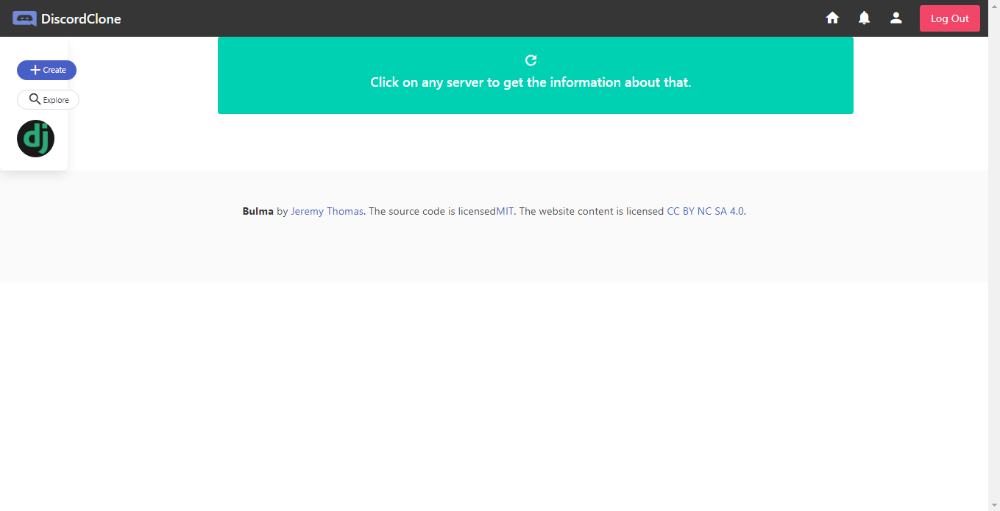
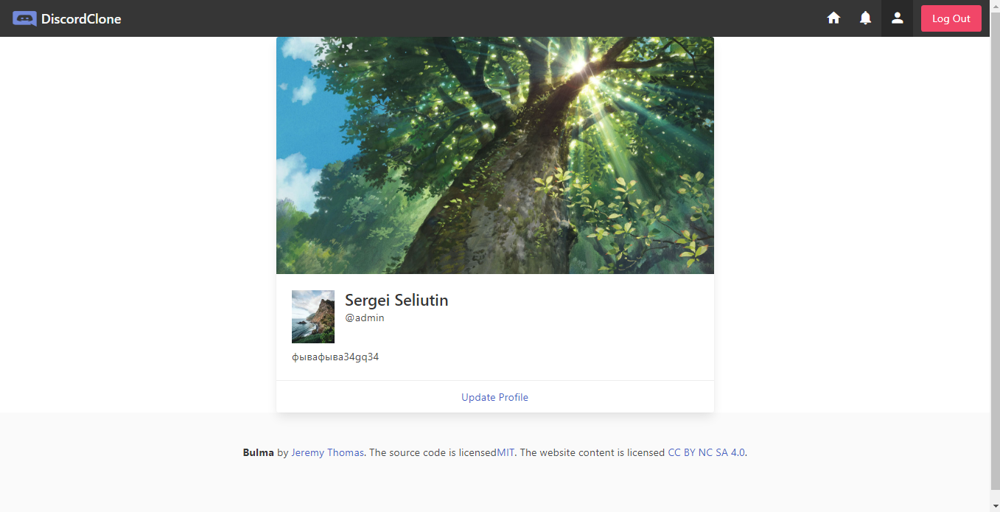
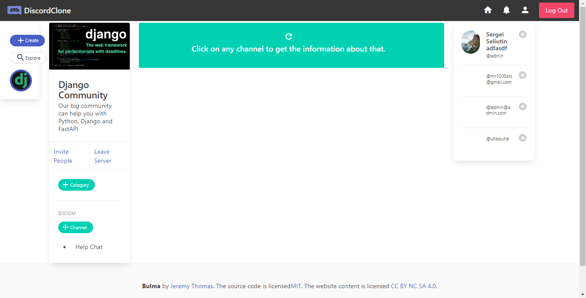
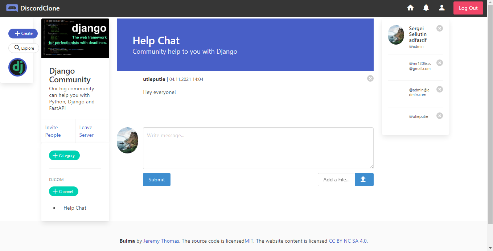

# Discord clone

My attempt to build a simple, not big discord clone






and some pages...

### For React

```
cd frontend
yarn install
yarn serve
yarn build
```

### For Django

```
pip install -r requirements.txt
python manage.py makemigrations
python manage.py migrate
python manage.py createsuperuser
python manage.py runserver
```
